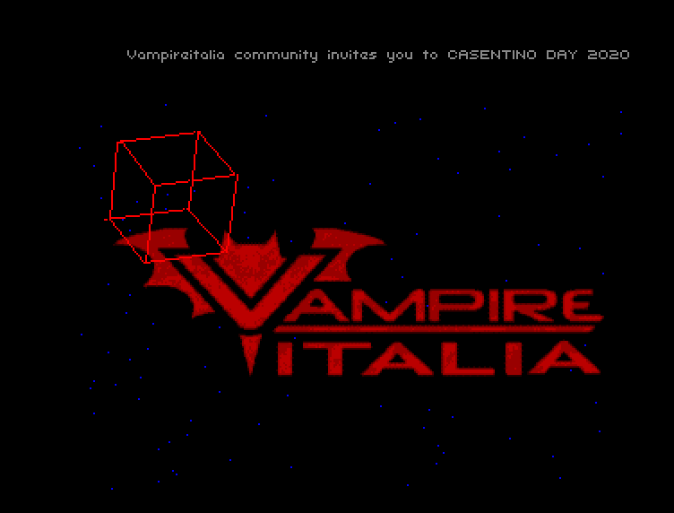
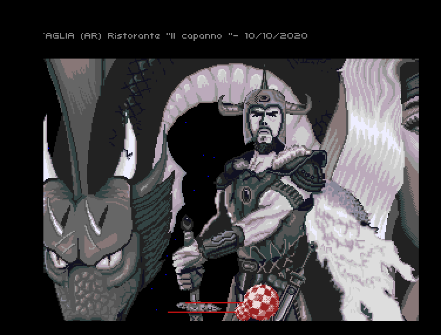
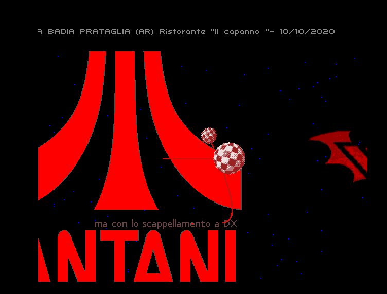

# Casentino Day 2020 - AmigaDemo

This is a small and simple invitation intro for Casentino day 2020, a small gathering in central Italy meant for Amiga enthusiasts that takes place every year in late summer (usually last week of August).   
Actually this yea, Casentino day turned into an online only event due Coronavirus concerns.

The  intro has been tested on real Amigas with following configurations:

- Amiga 1200 with ACA1221EC
- Amiga 600 stock with 2mb pcmcia fast ram
- Amiga 600 with vampireV2 accellerator
- Amiga 500 plus with ACA500+

It should run on any Amiga classic as long it's equipped with at least 1MB CHIP RAM + 1MB fast ram.   
For more information about us and if you are interested in our activities go to https://vampireitalia.forumfree.it/ .  

### How to run this stuff on a real amiga
Download the adf file from the github releases section or just copy the executable somewhere in your Amiga harddrive and run it (but you will miss the boot screen).

### Screenshots








### How to compile

```
~$ mkdir compile
~$ cd compile/
~/compile$ git clone https://github.com/Ozzyboshi/Casentinoday2020AmigaDemo.git
Cloning into 'Casentinoday2020AmigaDemo'...
remote: Enumerating objects: 496, done.
remote: Counting objects: 100% (496/496), done.
remote: Compressing objects: 100% (330/330), done.
remote: Total 496 (delta 229), reused 394 (delta 130), pack-reused 0
Receiving objects: 100% (496/496), 2.72 MiB | 4.01 MiB/s, done.
Resolving deltas: 100% (229/229), done.


docker run -it --rm -v "$HOME/compile/Casentinoday2020AmigaDemo:/data" -w /data ozzyboshi/acedocker:ks2.0-2020-07-17 /bin/bash

root@83972ea73ce0:/data# autoreconf -i
configure.ac:7: installing './compile'
configure.ac:3: installing './install-sh'
configure.ac:3: installing './missing'
src/Makefile.am: installing './depcomp'


ozzy@83972ea73ce0:/data# ./configure --host m68k
checking for a BSD-compatible install... /usr/bin/install -c
checking whether build environment is sane... yes
checking for m68k-strip... no
checking for strip... no
checking for a thread-safe mkdir -p... /bin/mkdir -p
checking for gawk... no
checking for mawk... mawk
...

root@83972ea73ce0:/data# make
Making all in _res
make[1]: Entering directory '/data/_res'
incbin.sh uni54.fnt uni54.h uni54
Fonts header file generated
...


```

At this point under floppy directory you will have the adf file named with your compilation date and under floppy/adf the final executable.


